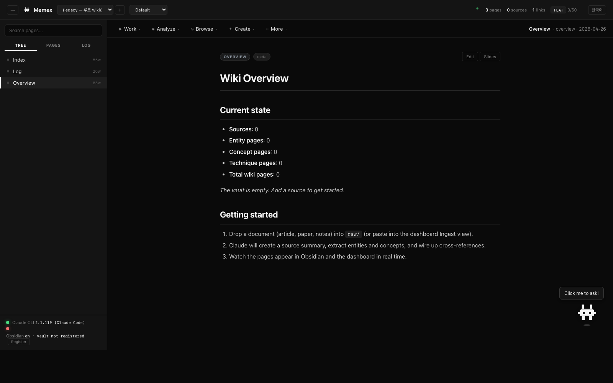
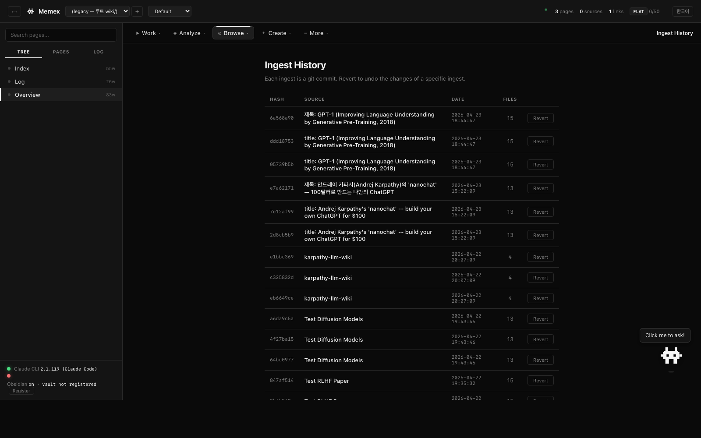
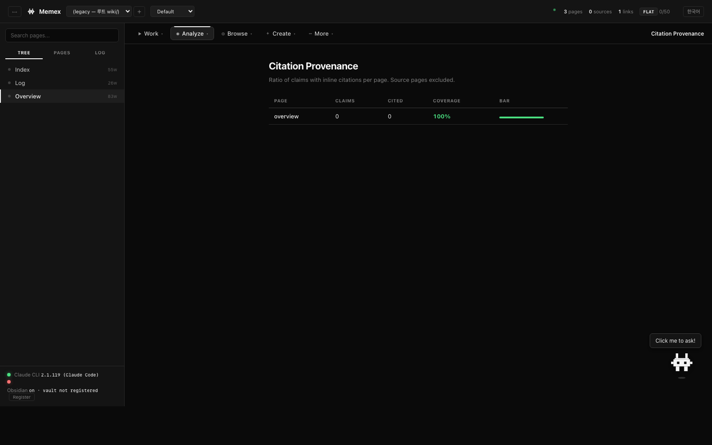
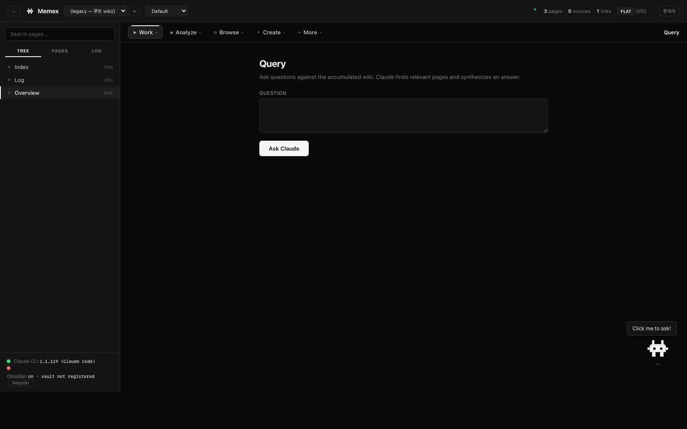

<div align="center">

<br />


<h1>Memex</h1>

<p><strong>A personal knowledge base that writes itself.</strong></p>

<p>
Drop a source. Claude does the bookkeeping.<br/>
Your knowledge compounds.
</p>

<p>
<a href="#quick-start"></a>
&nbsp;

&nbsp;

&nbsp;

&nbsp;
<a href="README-ko.md"></a>
</p>

<br />

<p>
<em>"Obsidian is the IDE. Claude is the programmer. The wiki is the codebase."</em>
</p>

<br />


</div>

---

## Why?

Most LLM-plus-documents setups **re-derive knowledge on every query**. RAG finds chunks, the model stitches an answer, nothing is kept. Ten queries against the same docs → ten rediscoveries.

**Memex inverts this.** You add a source once. Claude reads it, integrates it into a persistent wiki, flags contradictions against older pages, wires up citations, and commits the result. By query #10, the wiki is doing the synthesis for free — the bookkeeping has already happened.

Based on [Andrej Karpathy's LLM Wiki pattern](https://gist.github.com/karpathy/442a6bf555914893e9891c11519de94f). Named for [Vannevar Bush's 1945 Memex](https://en.wikipedia.org/wiki/Memex).

---

## The pattern

```
   projects/<slug>/    One topic = one project. Fully isolated.
     ├─ raw/           Original sources. Immutable. 4-layer protection.
     │    │
     │    ▼  ingest
     ├─ wiki/          Claude-maintained pages. Entities, concepts, summaries.
     │                 Inline citations [^src-*]. Auto cross-referenced.
     │                 Every change is a git commit (prefixed with slug).
     ├─ CLAUDE.md      Per-project schema (starts from a template)
     └─ .settings.json Per-project model (Opus / Sonnet / Haiku)
     ▼
   Obsidian graph + Dashboard
                       Switch projects. Browse, query, analyze, reflect, compare, write.
```

- **You**: curate sources, ask questions, direct the analysis, draw project boundaries.
- **Claude**: summarize, cross-reference, cite, detect contradictions, file. *Scoped to the selected project.*
- **The wiki**: compounds independently inside each project.

If `projects.json` is missing or empty, the server runs in legacy mode — treating the root `wiki/ raw/` as the default project (existing setups keep working unchanged).

---

## Quick start

### Local development (no Docker)

```bash
git clone https://github.com/cmblir/memex.git
cd memex
python dashboard/server.py    # Python 3.10+, zero pip deps
```

Open `http://localhost:8090`. Done.

<br />

<details>
<summary><strong>Requirements</strong></summary>

- Python 3.10+ (stdlib only)
- [Claude Code CLI](https://docs.anthropic.com/en/docs/claude-code) — `npm install -g @anthropic-ai/claude-code`
- A browser
- Obsidian — *optional* but pre-configured. The repo ships as a ready Obsidian vault.

</details>

### Docker deployment

Three services — **dashboard** (REST API + web UI), **mcp** (MCP server for Claude Code/Desktop), **nginx** (reverse proxy).

```bash
./deploy.sh deploy          # one-click: install + build + start
```

| Command | Description |
|---------|-------------|
| `./deploy.sh deploy` | Full pipeline: environment init + build all images + start + health checks |
| `./deploy.sh install` | Init environment (creates `.env` from `.env.example`) |
| `./deploy.sh build` | Build all images (dashboard + mcp + nginx) |
| `./deploy.sh start` | Start all services and wait for health checks |
| `./deploy.sh stop` | Stop all containers |
| `./deploy.sh restart` | Restart all containers |
| `./deploy.sh status` | Show container status, resource usage, ports |
| `./deploy.sh logs` | View logs (`-f` for streaming, `--service memex-mcp` for MCP only) |
| `./deploy.sh prune` | Clean orphaned containers and dangling images |
| `./deploy.sh destroy` | **Danger**: remove all containers, images, and volumes |

**Configuration** (`.env`):

```bash
MEMEX_PORT=8000              # External port (nginx maps to container port 80)
MEMEX_VERSION=0.1.0          # Docker image tag
MEMEX_TZ=Asia/Shanghai       # Container timezone
MEMEX_ACTIVE_PROJECT=        # Active project slug (empty = legacy mode)
MEMEX_WIKI_DIR=./wiki        # Wiki data mount path
MEMEX_RAW_DIR=./raw          # Raw sources mount path (read-only)
MEMEX_PROJECTS_DIR=./projects # Multi-project mount path
MEMEX_GIT_DIR=./.git         # Git repo mount path
MEMEX_MCP_TRANSPORT=stdio    # MCP transport: "stdio" (local) or "http" (remote)
```

After deployment, access:

| Service | URL | Purpose |
|---------|-----|---------|
| Dashboard | `http://localhost:8000` | Web UI + REST API |
| Health check | `http://localhost:8000/health` | Service health status |
| MCP server | stdio (default) or HTTP | See MCP access options below |

### Remote MCP access (server deployment)

Three one-click deployment scripts are provided in `scripts/`:

**Option 1: SSH stdio tunnel** — zero config, no open ports

```bash
bash scripts/deploy-ssh-stdio.sh user@your-server.com
```

Claude Code opens an SSH connection, runs `docker exec` into the MCP container, and communicates over stdio. Best for quick personal access.

**Option 2: HTTP via nginx** — production deployment, recommended

```bash
bash scripts/deploy-http-nginx.sh user@your-server.com   # remote
bash scripts/deploy-http-nginx.sh                        # local
```

MCP is proxied through nginx at `http://<host>:8000/mcp`. All traffic goes through port 80. Works with Claude Code and Claude Desktop.

**Option 3: Direct HTTP** — internal network

```bash
bash scripts/deploy-direct-http.sh user@your-server.com   # remote
bash scripts/deploy-direct-http.sh                        # local
```

MCP listens directly on port 8081. Requires firewall rule but no nginx config. Best for LAN-only access.

<details>
<summary><strong>Manual setup (without scripts)</strong></summary>

**SSH stdio:**
```bash
claude mcp add memex -- ssh user@your-server.com \
  "docker exec -i memex-mcp python3 /home/appuser/mcp-server/memex_mcp.py"
```

**HTTP via nginx:**
```bash
echo 'MEMEX_MCP_TRANSPORT=http' >> .env
./deploy.sh restart
# MCP available at http://<host>:8000/mcp
claude mcp add memex -- npx @anthropic-ai/mcp-remote --url http://<host>:8000/mcp
```

**Direct HTTP:**
```bash
echo 'MEMEX_MCP_TRANSPORT=http' >> .env
# Also expose port 8081 in docker-compose.yml
./deploy.sh restart
claude mcp add memex -- npx @anthropic-ai/mcp-remote --url http://<host>:8081/
```

</details>

<details>
<summary><strong>Which option should I choose?</strong></summary>

| Criteria | SSH stdio | HTTP via nginx | Direct HTTP |
|----------|-----------|----------------|-------------|
| Setup complexity | None | Low | Medium |
| Security | SSH key auth | Behind nginx | Open port required |
| Works with Claude Code | Yes | Yes | Yes |
| Works with Claude Desktop | No | Yes | Yes |
| Works with web Claude | No | Yes (with SSE) | Yes |
| Requires open ports | No (uses SSH) | Port 80 only | Port 8081 |
</details>

<details>
<summary><strong>Building individual services</strong></summary>

```bash
./deploy.sh build --only-dashboard   # Only dashboard
./deploy.sh build --only-mcp         # Only MCP server
```

</details>

<details>
<summary><strong>Docker Compose architecture</strong></summary>

```
nginx (:8000 → :80)
  │
  ├── memex-dashboard (:8000 internal)
  │     ├── volumes: wiki/, raw/, projects/, .git/, .dashboard-settings.json
  │     └── health: HTTP check on port 8000
  │
  └── memex-mcp (stdio mode)
        ├── volumes: wiki/, raw/, projects/, .git/, .dashboard-settings.json
        └── health: always returns 0 (stdio exits cleanly without stdin)
```

All services share the `memex-net` bridge network. Dashboard and MCP share the same `wiki/`, `raw/`, and `projects/` mounts, so changes from either surface are immediately visible.

</details>

---

## Talk to your wiki

Memex has **two chatbots**, and most people use both:

| | What it answers | Setup |
|---|---|---|
| **Floating dashboard helper** (the bobbing Claude character at bottom-right) | *About the dashboard itself* — "where do I revert?", "what does Wiki Ratio mean?". Wiki-content questions are redirected to Query. | None — built into the dashboard. |
| **External Claude (Code or Desktop) over MCP** | *About / inside the wiki* — read, search, write pages, ingest sources, commit. 14 tools exposed. | The 4-step wizard below. |

### MCP setup wizard

<details open>
<summary><b>Step 1 — Install the server</b> &nbsp;<sub>(once, ~20 seconds)</sub></summary>

```bash
bash mcp-server/install.sh
```

Creates `mcp-server/.venv` with the `mcp` SDK and prints the absolute
paths you'll paste into your client config. **Keep that output handy**
for Step 2.

The 14 exposed tools:

| Read-only | Mutating |
|---|---|
| `list_projects` `list_pages` `read_page` `search` `folder_tree` `stats` `recent_log` `list_raw_sources` `get_instructions` | `add_raw_source` `create_page` `update_page` `create_folder` `git_commit` |
</details>

<details>
<summary><b>Step 2 — Pick your client</b> &nbsp;<sub>(open exactly one)</sub></summary>

<br />

<details>
<summary>🅰&nbsp; <b>Claude Code</b> &nbsp;— terminal CLI, in or out of this repo</summary>

```bash
claude mcp add --scope user memex \
  -- "$PWD/mcp-server/.venv/bin/python" "$PWD/mcp-server/memex_mcp.py"

claude mcp list                       # memex should appear
```

`memex` is now registered for **every** Claude Code session. To remove:

```bash
claude mcp remove memex
```
</details>

<details>
<summary>🅱&nbsp; <b>Claude Desktop</b> &nbsp;— macOS / Windows app</summary>

> ⚠️ **Quit Claude Desktop completely first** — `Cmd+Q` on macOS.
> Closing the window only minimizes; the Dock icon keeps the old config
> in memory otherwise.

Open the config file:

| OS | Path |
|---|---|
| macOS | `~/Library/Application Support/Claude/claude_desktop_config.json` |
| Windows | `%APPDATA%\Claude\claude_desktop_config.json` |

Add the `memex` block (use the absolute paths `install.sh` printed —
replace `<you>` with your username):

```json
{
  "mcpServers": {
    "memex": {
      "command": "/Users/<you>/Memex/mcp-server/.venv/bin/python",
      "args": ["/Users/<you>/Memex/mcp-server/memex_mcp.py"]
    }
  }
}
```

If the file already has an `mcpServers` block, just add the `memex`
entry inside it. Reopen Claude Desktop. The 🔌 icon (top of the chat
input) should list **14 Memex tools**.
</details>

<details>
<summary>🅲&nbsp; <b>claude.ai web</b> &nbsp;— not supported, and why</summary>

Web Claude only supports remote HTTP / SSE MCP servers via Connectors —
it cannot reach a local stdio process. Use **Claude Desktop** for the
local Memex vault, or expose the server over the network with
`mcp-proxy` if you really need browser access.
</details>
</details>

<details>
<summary><b>Step 3 — Verify</b> &nbsp;<sub>(30 seconds)</sub></summary>

Open a new chat in your client and ask:

> List my Memex projects.

Claude should call `list_projects` and reply with names from
`projects.json`. If you see *"tool not found"* or *"memex not connected"*:

- Claude Code → re-run `claude mcp list` and check the path.
- Claude Desktop → confirm the JSON is valid (`python -m json.tool < <config>`),
  then **fully quit and reopen** (not just close the window).
</details>

<details>
<summary><b>Step 4 — Pin the schema</b> &nbsp;<sub>(optional, recommended for long sessions)</sub></summary>

At the start of an ingestion-heavy chat, paste:

> Call `memex.get_instructions` once. From now on treat factual content
> I share as wiki ingestion — write to the wiki with citations, ask
> before creating new pages, commit at the end. Anything I mark as
> *"draft"* stays in chat only.

This loads the project's `CLAUDE.md` (frontmatter rules, citation format,
contradiction policy) so Claude follows them without you repeating each turn.
</details>

### Use chat content as wiki sources

Once `memex` is registered, just talk to Claude in plain language — it
picks the right tools from intent.

| You say… | Claude does |
|---|---|
| *"Save this conversation to my Memex wiki as **Transformer scaling discussion**."* | composes a markdown summary → `add_raw_source` → updates affected entity / concept pages with `[^src-*]` citations → appends `wiki/log.md` → `git_commit` |
| *"Add what we just discussed about **scaling laws vs data quality** as an analysis page."* | `search` for related pages → `create_page(type=analysis)` → links from the closest entities → `git_commit` |
| *"Show me everything we have on **RLHF** and where sources conflict."* | `search` + `read_page` across hits → synthesized answer with contradictions surfaced |
| *"Switch the active project to **ml-papers** before we continue."* | `list_projects` → server-side switch → subsequent reads/writes scope to that project |

### MCP troubleshooting

<details>
<summary><b>Claude Desktop doesn't list the <code>memex</code> server</b></summary>

1. Validate the config is valid JSON:
   ```bash
   python -m json.tool < ~/Library/Application\ Support/Claude/claude_desktop_config.json
   ```
2. Verify both paths exist:
   ```bash
   ls -la /Users/<you>/Memex/mcp-server/.venv/bin/python \
          /Users/<you>/Memex/mcp-server/memex_mcp.py
   ```
3. `Cmd+Q` Claude Desktop, then reopen.
</details>

<details>
<summary><b><code>add_raw_source</code> refused: "file exists"</b></summary>

`raw/` is immutable by design — the tool refuses to overwrite. Use a
different `slug`, or update the wiki page through `update_page` instead.
</details>

<details>
<summary><b>Tools succeed but writes don't show in the dashboard</b></summary>

Both surfaces share `projects.json` and `wiki/`. Reload the dashboard
page — it polls but doesn't auto-push. Confirm the write committed in
`wiki/log.md`.
</details>

The MCP server and the dashboard share the same `projects.json` and
`wiki/` tree, so changes from either surface are immediately visible.
Full tool reference in [`mcp-server/README.md`](mcp-server/README.md).

---

## What you get

<table>
<tr>
<td width="50%" valign="top">

### ◆ Core operations
- **Ingest** — Paste source → diff + WHY report + auto-commit
- **Query** — Ask the wiki. Tracks files read, Wiki Ratio, tokens
- **Lint** — 16-point health check + auto-fix
- **Reflect** — Weekly meta-analysis of the whole wiki
- **Write** — Draft essays from the wiki, citations auto-inserted
- **Compare** — Two pages → similarities/differences
- **Review** — Spaced review of stale pages
- **Search** — TF-IDF full-text, zero deps
- **Slides** — Export any page as a Marp deck
- **Graph** — Force-directed knowledge graph

</td>
<td width="50%" valign="top">

### ◆ Infrastructure
- **Multi-project** — isolated wikis, models, templates under one dashboard
- **Git-backed history** — every ingest is a commit (`ingest(slug): ...`)
- **One-click revert** — undo any ingest
- **Inline citations** — `[^src-*]` rendered as badges
- **raw/ immutability** — 4 layers of protection, applied to every project's `raw/`
- **Adaptive indexing** — flat → hierarchical → indexed (auto)
- **Schema (CLAUDE.md)** — root common + per-project
- **WHY reports** — every ingest explains its own decisions
- **Query log** — per-project Wiki Ratio gauge
- **Bilingual UI** — EN / 한국어 toggle
- **Model selector** — Opus / Sonnet / Haiku, pickable per project

</td>
</tr>
</table>

---

## The dashboard

<div align="center">
<em>Monochrome. Categorized. Interactive.</em>
</div>

<br />

- **Black & white** — color is reserved for status and diffs only.
- **Project selector** — header dropdown switches the active project (`Cmd/Ctrl + P` to focus). `+` creates a new project, `×` soft-deletes.
- **Model-linked** — the model dropdown syncs to the selected project's model. Different models per project are fine.
- **Categorized toolbar** — 13 operations in 5 dropdowns (Work, Analyze, Browse, Create, More).
- **Resizable sidebar** — drag the edge, or `Cmd/Ctrl + B` to collapse.
- **Folder continuous view** — click a folder *name* to read all its pages in one scroll.
- **Live status** — Claude CLI + Obsidian detection, raw facts only.
- **Wiki Ratio gauge** — per-project: how often Claude reached into wiki vs raw. Below 0.4 means the wiki isn't replacing raw yet.
- **Floating Claude character** — click for an in-dashboard chatbot that answers questions *about the dashboard*. Wiki-content questions get redirected to Query.

### Views

<table>
<tr>
<td width="50%"></td>
<td width="50%"></td>
</tr>
<tr>
<td align="center"><sub><strong>Overview</strong> — wiki stats, coverage areas, getting started</sub></td>
<td align="center"><sub><strong>Graph</strong> — force-directed knowledge graph</sub></td>
</tr>
<tr>
<td width="50%"></td>
<td width="50%"></td>
</tr>
<tr>
<td align="center"><sub><strong>Ingest</strong> — paste source, Claude generates pages</sub></td>
<td align="center"><sub><strong>History</strong> — git-backed ingest timeline with revert</sub></td>
</tr>
<tr>
<td width="50%"></td>
<td width="50%"></td>
</tr>
<tr>
<td align="center"><sub><strong>Provenance</strong> — per-page citation coverage</sub></td>
<td align="center"><sub><strong>Query</strong> — ask the wiki, tracks files read</sub></td>
</tr>
</table>

<sub><em>Want your own screenshots? Run <code>docs/capture.sh</code> while the server is up.</em></sub>

---

## How knowledge accumulates

Everything below happens inside `projects/<slug>/` (or at the root in legacy mode):

```
You drop a source ─────►  projects/<slug>/raw/article.md
                          │
                          ▼
  Claude runs with the project root as cwd and loads its CLAUDE.md:
  ├─ wiki/sources/source-article.md   (source summary)
  ├─ wiki/entities/entity-X.md        (new or updated)
  ├─ wiki/concepts/concept-Y.md       (new or updated, with citations)
  ├─ wiki/index.md                    (updated)
  ├─ wiki/log.md                      (appended)
  └─ ingest-reports/...md             (WHY report)

                          │
                          ▼
  git commit "ingest(<slug>): <title>"
                          │
                          ▼
  Dashboard shows: diff + reasoning + approve / revert
```

Every ingest is revertable. Every claim has a citation. Every contradiction gets one of three policies (Historical / Disputed / Superseded). Each project is fully isolated — an ingest in project A cannot touch project B's files.

---

## CLI usage

Three surfaces, one wiki — pick whichever fits the moment.

**1. Dashboard** — visual graph + form-driven ingest at `http://localhost:8090`.

**2. Claude Code in this repo** — the dashboard shells out to `claude -p`,
so the same prompts work from a terminal here:

```bash
claude
"Ingest raw/some-article.md"
"What is Self-Attention?"
"Lint the wiki"
"Reflect on the last 10 ingests"
```

**3. MCP from anywhere** — once `mcp-server/install.sh` is registered,
any Claude Code session (in or out of this repo) and Claude Desktop can
call the 14 Memex tools directly. See the [Talk to your wiki](#talk-to-your-wiki)
section above for the 4-step setup wizard.

All three share `projects.json` and the `wiki/` tree — changes are
immediately visible across surfaces.

---

## Configuration

```bash
# Environment variables
CLAUDE_TIMEOUT=1200  python dashboard/server.py   # 20-min timeout for large ingests
CLAUDE_QUICK_TIMEOUT=30
CLAUDE_TOOLS=Edit,Write,Read,Glob,Grep
```

**Per-project settings**
- `projects/<slug>/.settings.json` — current project's model. Editable via the header model dropdown.
- `projects/<slug>/CLAUDE.md` — Claude rules for that project. Starts from a template copy; edit freely.
- `projects.json` — registry + currently active project.

**Root common schema**
- `CLAUDE.md` (root) — universal rules across projects (truthfulness, git, modularization, performance). Per-project `CLAUDE.md` takes precedence, but the core principles stay.

Adjust frontmatter rules, citation rules, contradiction resolution, ingest workflow, and the lint checklist here — changes take effect on the next operation.

---

## Troubleshooting

<details>
<summary><strong>"Claude CLI timeout"</strong></summary>

Default is 10 min. Increase with `CLAUDE_TIMEOUT=1800`. The dashboard shows a **Run Claude CLI diagnostic** button on timeout — it calls `/api/claude/diagnose` and checks installation, auth, response time, model speed.

</details>

<details>
<summary><strong>"vault not registered"</strong></summary>

Hover the status bar — it shows your project path vs Obsidian's known vaults. Click **Register** to auto-add to `obsidian.json`, then restart Obsidian.

</details>

<details>
<summary><strong>Slow ingestion</strong></summary>

Opus 4.7 is slowest. Switch to **Sonnet 4.6** or **Haiku 4.5** in the header dropdown for faster ingests.

</details>

<details>
<summary><strong>Expecting value: line 1 column 1</strong></summary>

This is Python's empty-JSON error. Fixed — all endpoints now return valid JSON even on crash. If you still see it, check `/tmp/wiki-server.log` for the traceback.

</details>

---

## Repository layout

```
raw/                       (legacy) Immutable sources — moved under a project on migration
wiki/                      (legacy) Claude-maintained pages
  index.md                 Content catalog (auto flat/hierarchical)
  log.md                   Activity timeline
  overview.md              Stats + coverage areas
ingest-reports/            One WHY report per ingest
reflect-reports/           Weekly meta-analyses
projects/                  Multi-project root (see section below)
  <slug>/
    CLAUDE.md              Project schema
    .settings.json         Per-project model, etc.
    wiki/                  Project wiki (sources/entities/concepts/...)
    raw/                   Project sources
    ingest-reports/, reflect-reports/, plans/, query-log.jsonl
projects.json              Project registry (active + list)
templates/                 Project templates (generic + variants)
plans/                     Work queue / backlog / blocked
logs/                      Autonomous-mode session logs
dashboard/
  server.py                Zero-dep API server
  project_registry.py      Project resolver + registry
  index.html               Single-file dashboard UI
  provenance.py            Citation parsing + coverage
  index_strategy.py        Adaptive indexing
  claude_character.svg     The floating helper
CLAUDE.md                  Root common schema
.obsidian/                 Pre-configured vault
```

---

## Multi-project

Run multiple independent topics (projects) from a single dashboard. Each project has its own `wiki/ raw/ CLAUDE.md .settings.json`, with independently configurable model, template, and folder structure.

**In the dashboard**

- Header dropdown to switch the active project (Cmd/Ctrl+P to focus)
- `+` button opens the New Project modal (title / slug / description / template / model)
- `×` button moves the current project to `projects/.trash/` (soft delete; files preserved)
- Switching scopes every subsequent action (Ingest / Query / Lint / Write / Compare / ...) to that project's `raw/` and `wiki/`

**Templates**

Choosing a template at creation time automatically scaffolds `wiki/` subfolders:

| Template | Default folders |
|---|---|
| generic | `sources entities concepts techniques analyses` |
| llm-research | `sources models techniques concepts entities benchmarks analyses` |
| reading-log | `sources authors ideas quotes reviews` |
| personal-notes | `daily topics people projects` |

Template `CLAUDE.md` files live at `templates/<name>/CLAUDE.md` and are copied (with `{{TOPIC}}` / `{{PURPOSE}}` substitution) into the new project.

**API (available from the command line too)**

```bash
# List projects + active
curl http://localhost:8090/api/projects

# Create
curl -X POST http://localhost:8090/api/projects/create \
  -H 'Content-Type: application/json' \
  -d '{"slug":"ml-papers","title":"ML Papers","description":"papers",
       "model":"claude-sonnet-4-6","template":"llm-research"}'

# Switch
curl -X POST http://localhost:8090/api/projects/switch \
  -H 'Content-Type: application/json' -d '{"slug":"ml-papers"}'

# Scoped calls
curl "http://localhost:8090/api/wiki?project=ml-papers"
curl -X POST http://localhost:8090/api/ingest \
  -H 'Content-Type: application/json' \
  -d '{"project":"ml-papers","title":"...","content":"..."}'
```

**Legacy compatibility**

If `projects.json` is missing or empty, the server runs in legacy mode — treating the root `wiki/ raw/ CLAUDE.md` as the default project. Existing setups keep working unchanged until you create your first project.

---

## API

Dashboard talks to the server via 35+ endpoints. Most endpoints accept a project scope via the `?project=<slug>` query string (GET) or a `"project"` field in the JSON body (POST); omitting it falls back to the active project.

<details>
<summary><strong>Show all endpoints</strong></summary>

**Project management**

| Method | Path | Description |
|--------|------|-------------|
| GET | `/api/projects` | List projects + active + legacy info |
| GET | `/api/projects/active` | Current active project |
| GET | `/api/templates` | Available templates + recommended folders |
| POST | `/api/projects/create` | New project (slug / title / description / model / template) |
| POST | `/api/projects/switch` | Switch active project |
| POST | `/api/projects/update` | Update project model / title / description |
| POST | `/api/projects/delete` | Soft delete → `projects/.trash/` |

**Data / status**

| Method | Path | Description |
|--------|------|-------------|
| GET | `/api/status` | Claude CLI + Obsidian — raw facts only |
| GET | `/api/wiki` | Full wiki data (project-scoped) |
| GET | `/api/folders` | Folder tree (project-scoped) |
| GET | `/api/hash` | Change detection (project-scoped) |
| GET | `/api/schema` | Read CLAUDE.md (project-scoped) |
| GET | `/api/history` | Ingest commits |
| GET | `/api/provenance` | Citation coverage (project-scoped) |
| GET | `/api/query-stats` | Wiki Ratio (project-scoped) |
| GET | `/api/index/status` | Strategy badge (project-scoped) |
| GET | `/api/raw/integrity` | raw/ tampering check |
| GET | `/api/reflect/status` | Last reflect date (project-scoped) |
| GET | `/api/review/list` | Stale pages (project-scoped) |
| GET | `/api/settings` | Model options + per-project current model |
| GET | `/api/claude/diagnose` | CLI quick check |

**Operations (all project-scoped)**

| Method | Path | Description |
|--------|------|-------------|
| POST | `/api/ingest` | New source → wiki pages |
| POST | `/api/query` | Ask the wiki |
| POST | `/api/query/save` | Save answer as page |
| POST | `/api/lint` / `/api/lint/fix` | Health check |
| POST | `/api/reflect` | Meta-analysis |
| POST | `/api/write` | Writing companion |
| POST | `/api/compare` | Two-page analysis |
| POST | `/api/review/refresh` | Refresh a stale page |
| POST | `/api/slides` | Marp export |
| POST | `/api/search` | TF-IDF search |
| POST | `/api/suggest/sources` | What to ingest next |
| POST | `/api/provenance/fix` | Add missing citations |
| POST | `/api/index/rebuild` | Force index rebuild |
| POST | `/api/revert` | Revert an ingest (repo-wide git) |
| POST | `/api/page` / `/update` / `/delete` | Page CRUD |
| POST | `/api/folder` | Create folder |
| POST | `/api/schema` | Update CLAUDE.md |
| POST | `/api/settings` | Change model (legacy → global; project → `.settings.json`) |
| POST | `/api/assistant` | Dashboard helper chatbot (project-agnostic) |
| POST | `/api/obsidian/register` | Add this folder to obsidian.json |

</details>

## Star History

<a href="https://www.star-history.com/?repos=cmblir/memex&type=date&legend=top-left">
 <picture>
   <source media="(prefers-color-scheme: dark)" srcset="https://api.star-history.com/chart?repos=cmblir/memex&type=date&theme=dark&legend=top-left" />
   <source media="(prefers-color-scheme: light)" srcset="https://api.star-history.com/chart?repos=cmblir/memex&type=date&legend=top-left" />
   
 </picture>
</a>

---

## Keyboard shortcuts

- `Cmd/Ctrl + P` — focus the project selector
- `Cmd/Ctrl + B` — toggle sidebar
- `Esc` — close dropdowns / modals

---

## Credits

- **Pattern**: [Andrej Karpathy](https://github.com/karpathy) — *[LLM Wiki](https://gist.github.com/karpathy/442a6bf555914893e9891c11519de94f)*.
- **Ancestor**: [Vannevar Bush, "As We May Think"](https://en.wikipedia.org/wiki/As_We_May_Think), 1945.
- **Built with**: [Claude Code](https://docs.anthropic.com/en/docs/claude-code).

---

<div align="center">
<br/>
<sub>MIT License · <a href="README-ko.md">한국어 README</a></sub>
</div>
