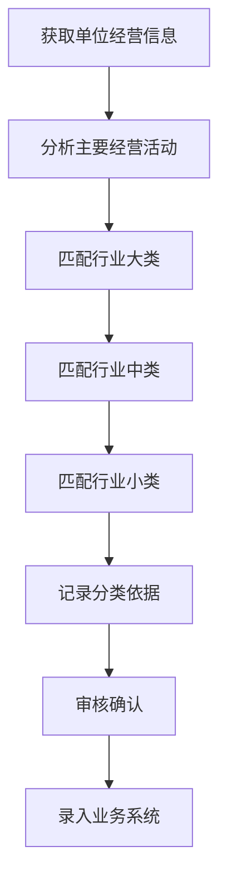

# 行业领域管理规范

## 规范适用范围
本规范依据《国民经济行业分类标准 (GB/T 4754—2017)》制定，适用于企业经营管理、市场监管、统计分析、政策制定等场景下的行业分类管理工作。

## 规范使用原则
1. **统一性原则**：所有行业分类必须严格遵循GB/T 4754—2017国家标准，不得自行定义行业类别
2. **准确性原则**：行业划分应根据单位的主要经营活动确定，确保分类准确
3. **时效性原则**：行业分类应根据经营活动变化及时更新，每年至少复核一次
4. **一致性原则**：同一单位在不同业务系统中的行业分类应保持一致

## 行业分类管理流程

### 1. 行业划分判定流程


### 2. 判定标准
- **主要经营活动判定**：当单位从事多种经济活动时，以占单位全年增加值比重最大的活动为主要活动
- **跨行业经营判定**：对涉及多个行业的单位，除标注主要行业外，应同时标注次要行业分类
- **新兴行业判定**：对于国家标准中未明确涵盖的新兴业态，应先归属到最接近的大类/中类，并标注"新兴业态"标识

## 各行业领域管理规范细则

### A. 农、林、牧、渔业
- **管理要点**：
  - 区分种养殖、加工、销售等不同环节的行业属性
  - 农业专业合作社统一归属到"051 农业专业合作社"中类
  - 农产品初级加工归属制造业，深加工根据产品类型确定
- **审核要点**：
  - 核实经营许可证、土地承包合同等证明材料
  - 对涉及野生动植物养殖的需提供相关部门审批文件

### B. 采矿业
- **管理要点**：
  - 严格区分开采、洗选、加工等不同环节
  - 采矿辅助活动单独归类到"11 开采专业及辅助性活动"
  - 矿产资源勘探归属"747 地质勘查"（科学研究和技术服务业）
- **审核要点**：
  - 必须提供采矿许可证、安全生产许可证等资质文件
  - 尾矿处理、矿山修复等归属"N 水利、环境和公共设施管理业"

### C. 制造业
- **管理要点**：
  - 共31个大类，需根据主要产品类型精准匹配
  - 代工生产(OEM/ODM)根据代工产品所属行业归类
  - 智能制造企业需同时标注所属制造业大类和"I65 软件和信息技术服务业"
- **审核要点**：
  - 核实产品清单、生产工艺流程等资料
  - 对涉及危化品生产的需提供安全生产许可证

### D. 电力、热力、燃气及水生产和供应业
- **管理要点**：
  - 生产与销售环节需分别归类
  - 新能源发电(光伏、风电等)归属"441 电力生产"
  - 充电桩运营归属"442 电力供应"
- **审核要点**：
  - 提供行业经营许可证、安全生产许可证等

### E. 建筑业
- **管理要点**：
  - 区分房屋建筑、土木工程、建筑安装、装饰装修等不同类型
  - 工程总承包企业根据工程类型归类
  - 工程监理、设计归属"M 科学研究和技术服务业"
- **审核要点**：
  - 提供建筑业企业资质证书
  - 园林绿化工程归属"7890 绿化管理"（公共设施管理业）

### F. 批发和零售业
- **管理要点**：
  - 严格区分批发(B2B)与零售(B2C)属性
  - 电商平台运营归属"I643 互联网平台"
  - 进出口贸易归属"518 贸易代理"
- **审核要点**：
  - 根据销售对象、交易规模判定批发/零售属性
  - 涉及特许经营的需提供相关资质

### G. 交通运输、仓储和邮政业
- **管理要点**：
  - 区分客运、货运、仓储、快递等不同业态
  - 网约车平台归属"I643 互联网平台"
  - 冷链物流归属"59 仓储业"
- **审核要点**：
  - 提供道路运输经营许可证、快递业务经营许可证等
  - 多式联运企业根据主要运输方式归类

### H. 住宿和餐饮业
- **管理要点**：
  - 区分住宿、餐饮、民宿等不同类型
  - 酒店配套餐饮服务统一归属"61 住宿业"
  - 外卖配送服务归属"62 餐饮业"
- **审核要点**：
  - 提供食品经营许可证、卫生许可证等
  - 民宿经营需提供特种行业许可证

### I. 信息传输、软件和信息技术服务业
- **管理要点**：
  - 区分基础电信、增值电信、互联网服务、软件服务等
  - 人工智能企业根据核心业务归类：
    - AI软件开发归属"651 软件开发"
    - AI数据服务归属"654 数据处理和存储支持服务"
    - AI算力服务归属"641 互联网接入及相关服务"
  - 云计算、大数据、物联网等业态均归属本门类
- **审核要点**：
  - 涉及电信业务的需提供电信业务经营许可证
  - 软件企业需提供软件著作权等证明材料

### J. 金融业
- **管理要点**：
  - 区分银行、证券、保险、基金、信托等不同金融业态
  - 类金融业务(小贷、担保、典当等)归属"69 其他金融业"
  - 金融科技企业根据核心业务归类：
    - 金融软件开发归属"I651 软件开发"
    - 金融信息服务归属"694 金融信息服务"
- **审核要点**：
  - 必须提供金融监管部门颁发的经营许可证
  - 地方金融组织需提供地方金融监管部门批复

### K. 房地产业
- **管理要点**：
  - 区分房地产开发、经营、中介、租赁、物业管理等
  - 保障性住房建设归属"47 房屋建筑业"
  - 长租公寓运营归属"704 房地产租赁经营"
- **审核要点**：
  - 提供房地产开发企业资质证书
  - 物业管理企业需提供物业资质证书

### L. 租赁和商务服务业
- **管理要点**：
  - 区分有形动产租赁、无形资产租赁、商务服务等
  - 人力资源服务归属"726 人力资源服务"
  - 企业管理咨询归属"724 咨询与调查"
- **审核要点**：
  - 涉及特种租赁业务的需提供相关资质
  - 劳务派遣企业需提供劳务派遣经营许可证

### M. 科学研究和技术服务业
- **管理要点**：
  - 区分研究开发、专业技术服务、科技推广等
  - 检验检测服务归属"745 质检技术服务"
  - 知识产权服务归属"752 知识产权服务"
- **审核要点**：
  - 高新技术企业需提供高新技术企业证书
  - 检验检测机构需提供CMA/CNAS资质证书

### N. 水利、环境和公共设施管理业
- **管理要点**：
  - 区分水利管理、生态保护、环境治理、公共设施管理等
  - 污水处理归属"772 水污染治理"
  - 环卫服务归属"782 环境卫生管理"
- **审核要点**：
  - 提供环境污染治理资质、市政公用事业经营许可证等

### O. 居民服务、修理和其他服务业
- **管理要点**：
  - 区分居民服务、机动车/电子产品修理、其他服务等
  - 家政服务归属"809 其他居民服务业"
  - 美容美发、健身服务归属"805 美容服务"等细分中类
- **审核要点**：
  - 涉及特种行业的需提供特种行业许可证
  - 家电维修企业需提供相关品牌授权

### P. 教育
- **管理要点**：
  - 区分学前教育、初等教育、中等教育、高等教育、职业技能培训等
  - 线上教育机构根据教育内容归类
  - 职业技能培训归属"839 技能培训、教育辅助及其他教育"
- **审核要点**：
  - 提供办学许可证、民办非企业单位登记证书等
  - 校外培训机构需提供教育部门审批文件

### Q. 卫生和社会工作
- **管理要点**：
  - 区分医院、基层医疗卫生机构、公共卫生机构、社会工作等
  - 互联网医疗归属"849 其他卫生活动"
  - 养老服务归属"851 提供住宿的社会工作"
- **审核要点**：
  - 提供医疗机构执业许可证、养老机构设立许可证等
  - 涉及药品、医疗器械销售的需额外提供相关资质

### R. 文化、体育和娱乐业
- **管理要点**：
  - 区分新闻出版、广播影视、文化艺术、体育、娱乐等
  - 网络游戏归属"862 出版业"（数字出版）
  - 直播电商归属"F52 零售业"
- **审核要点**：
  - 提供文化经营许可证、网络文化经营许可证、广播电视节目制作经营许可证等
  - 体育场馆经营需提供高危险性体育项目经营许可证

### S. 公共管理、社会保障和社会组织
- **管理要点**：
  - 区分党政机关、人民团体、群众团体、社会组织等
  - 行业协会商会归属"962 社会团体"
  - 基金会归属"963 基金会"
- **审核要点**：
  - 提供事业单位法人证书、社会团体法人登记证书、基金会法人登记证书等

### T. 国际组织
- **管理要点**：
  - 仅适用于国际组织驻华机构
  - 国际组织驻华代表处归属"970 国际组织"
- **审核要点**：
  - 提供外交部等相关部门颁发的登记证书

## 行业分类变更管理
1. **变更触发条件**：
   - 单位主要经营活动发生重大变化
   - 国家标准更新调整
   - 原有分类判定错误
2. **变更流程**：
   - 提交分类变更申请及相关证明材料
   - 行业分类管理部门审核
   - 变更结果公示
   - 各业务系统同步更新
3. **变更记录要求**：所有分类变更必须留存变更依据、审核记录、生效时间等完整档案

## 监督与考核
1. **定期检查**：每年组织一次行业分类准确性专项检查，检查覆盖率不低于30%
2. **考核指标**：
   - 行业分类准确率 ≥ 98%
   - 分类更新及时率 = 100%
   - 跨系统分类一致率 = 100%
3. **责任追究**：对故意错报、漏报行业分类的单位和个人，按相关规定追究责任

## 附：行业分类编码规则
```
门类（1位字母） + 大类（2位数字） + 中类（3位数字） + 小类（4位数字）
例：C 制造业 → 39 计算机、通信和其他电子设备制造业 → 391 计算机制造 → 3911 计算机整机制造
```

本规范自发布之日起施行，由行业分类管理部门负责解释和修订。